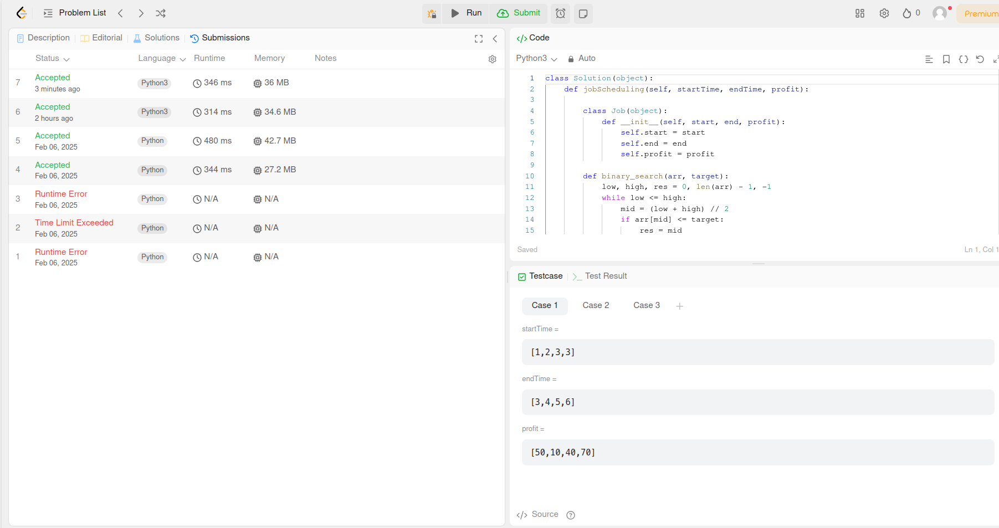
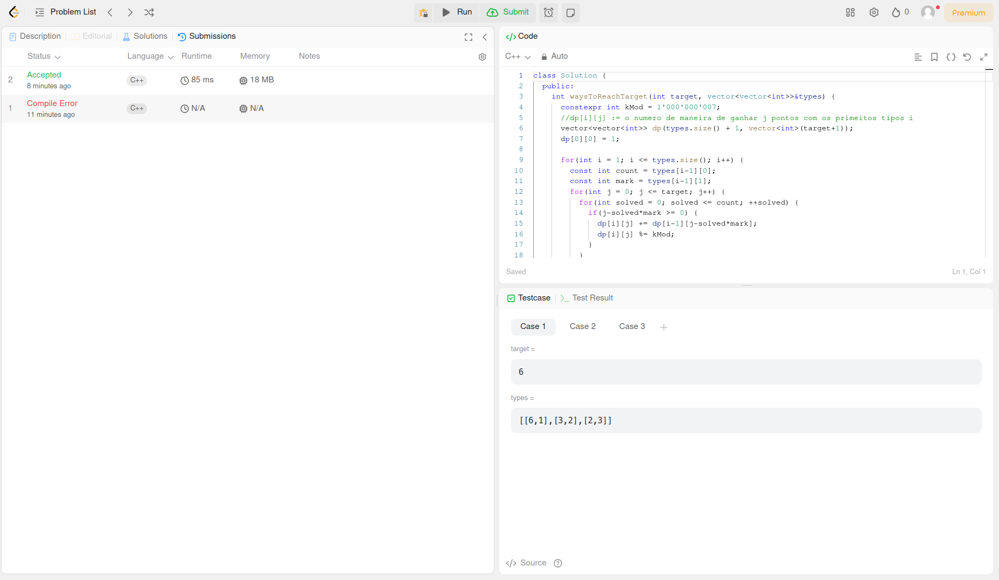

# PD_OJ_Problems

**Número da Lista**: 15 
**Conteúdo da Disciplina**: Programação Dinâmica 

## Alunos

| Matrícula  | Aluno                                  |
| ---------- | -------------------------------------- |
| 22/1022604 | João Victor da Silva Batista de Farias |
| 22/1031363 | Renan Vieira Guedes                    |

## Sobre
- Leetcode: Medium [Coin Change](https://leetcode.com/problems/coin-change/)
- Leetcode: Hard [Weighted Inteval Scheduling](https://leetcode.com/problems/maximum-profit-in-job-scheduling/)
- Leetcode: Knapsack Hard [Number of ways to earn points](https://leetcode.com/problems/number-of-ways-to-earn-points/description/)

## Screenshots
- Coin Change:

- Weighted Interval Scheduling;

- Knapsack;

## Instalação

**Linguagem**: C++ 

### Como rodar o projeto

1. Acesse os links dos problemas acima.
2. Copie o código de cada arquivo.
3. E cole para a solução de cada problema. 

# Video de apresentação

[Video de apresentação em 10/02/2025 das questões resolvidas](https://youtu.be/dy5gVyVjZLs)

Renan V. Guedes
- Coin Change
- Knapsack

João V. Farias
- Weighted Interval Schedule